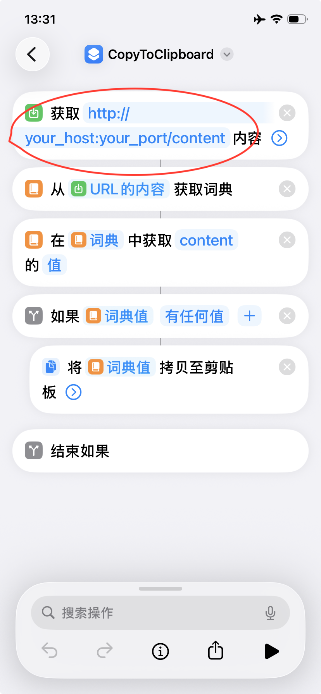
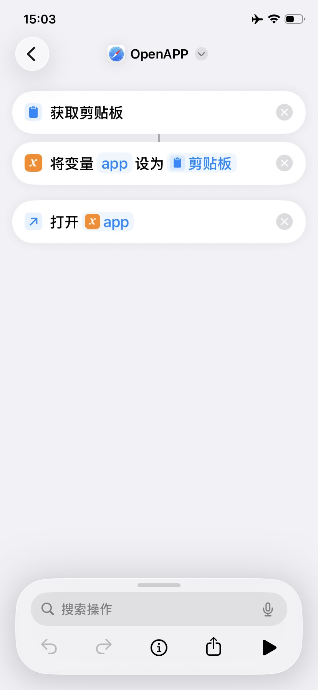

# 📱 Open iPhone Agent — 开放的 iPhone 智能体框架

> 本项目基于开源项目 **[Open-AutoGLM](https://github.com/zai-org/Open-AutoGLM)** 与 **[PiKVM](https://github.com/pikvm/pikvm)** 二次开发。在此向原项目致敬。

> 模型与推理配置参考并基于智谱 AI（Z.ai）开源的 Open-AutoGLM。目的是将开源多模态大模型能力延伸到 iPhone 操作场景，打造一个可扩展、可替换底层硬件的 **iPhone 智能体（Agent）框架**，以解锁“AI 驱动的 iPhone 自动化”场景。

[](https://www.bilibili.com/video/BV1UDqpBTEcc)
---

## 当前状态（Important）

* 项目处于 **PoC（概念验证）阶段**。
* 已找到 **可替代 PiKVM 的方案**，未来可选地**移除对 PiKVM 的硬件依赖**。
* 已在 **iPhone 15 / 16 / 17** 上完成实验性验证。
* 目标用户：开发者、研究者与对 iPhone 自动化有探索需求的工程团队。
>⚠️ 本项目仅供研究和学习使用。严禁用于非法获取信息、干扰系统或任何违法活动。请仔细审阅 使用条款(resources/privacy_policy.txt)。
---

## 核心能力（What it does）

* 使用开源**多模态大模型**（视觉 + 文本）来理解屏幕并规划操作。
* 将**视觉理解 → 任务规划 → 动作生成**串联为可执行指令。
* 通过 **iOS Shortcuts（快捷指令）** 实现文本输入、App 启动/跳转等动作。
* 支持自然语言指令（中/英双语），并可通过第三方或本地模型部署运行（灵活）。

---

## 架构概览

```
用户指令（文本 / 语音）
   ↓
AutoGLM-Phone（本地或云端推理）
   ↓
iPhone Agent（任务规划 & 动作生成）
   ↓
PiKVM / 替代方案（视频采集 + 键鼠/OTG 输入）
   ↓
iPhone（Shortcut 接收并执行）
```

---

## 已验证环境

* iOS：**iOS 17.2.1 及以上**（实测机型：iPhone 15/16/17）
* 推荐模型：**AutoGLM-Phone-9B**（含多语言版本）
* 支持中/英文等多语言场景

---

## 硬件（示例配置 — 可替换）

> 下面以 **树莓派 4B + PiKVM** 为示例。后续可选用替代方案移除对该硬件的依赖。

**硬件清单**

* 树莓派 4B（或其他能运行 PiKVM 的设备）
* OTG 扩展模块（用于 USB 键鼠注入）
* HDMI 采集卡（用于视频采集）
* HDMI 数据线
* Type-C 集线器（须包含 USB 与 HDMI 输出）

**连接示意**

1. 将 iPhone 通过 Type-C 集线器连接。
2. 集线器 HDMI → HDMI 采集卡；USB → OTG 扩展模块。
3. HDMI 采集卡连接至树莓派（PiKVM）。
4. OTG 模块用于将键盘/鼠标输入注入 iPhone（或替代方案注入）。
<p>
  
</p>
---

## 软件与模型（下载）

| Model             | Download Links|
|-------------------|---------------|
| AutoGLM-Phone-9B  | [🤗 Hugging Face](https://huggingface.co/zai-org/AutoGLM-Phone-9B)<br>[🤖 ModelScope](https://modelscope.cn/models/ZhipuAI/AutoGLM-Phone-9B)|
| AutoGLM-Phone-9B-Multilingual | [🤗 Hugging Face](https://huggingface.co/zai-org/AutoGLM-Phone-9B-Multilingual)<br>[🤖 ModelScope](https://modelscope.cn/models/ZhipuAI/AutoGLM-Phone-9B-Multilingual)|

> **感谢智谱 AI（[Z.ai](https://bigmodel.cn/)）对 Open-AutoGLM 的开源贡献。**

---

## 环境准备

### 系统与语言

* 推荐 Python **3.10+**

### iPhone 端（Shortcuts）

* 在 iPhone 上安装需要的快捷指令，[OpenAPP](https://www.icloud.com/shortcuts/c2560bb5426449eda720b409f89627a7)、[CopyToClipboard](https://www.icloud.com/shortcuts/f61c7bdd585a46de903852173620706e)（或自定义等价快捷指令）。
* 在 `CopyToClipboard` 中配置服务器地址为本机/服务端的 `FastAPI` IP:PORT（用于接收由 Agent 发出的内容/指令）。
<div style="display:flex; gap:10px;">
  
  
</div>
---

## 快速部署指南

### 安装项目依赖

```bash
pip install -r requirements.txt
pip install -e .
```

### 启动 FastAPI 服务（项目根目录下新终端）

```bash
uvicorn iphone_agent.fastapi_main:app --reload --host 0.0.0.0 --port 6666
```

---

## 第一次使用（iPhone 无障碍与快捷键配置）

> 为了让 Agent 能模拟键盘交互，需要在 iPhone 上开启无障碍相关选项并为快捷指令分配键盘命令（可能需要物理或蓝牙键盘）。

**步骤（按序）**

1. 设置 → 无障碍 → 触控 → **辅助触控**：开启。
2. 设置 → 无障碍 → 键盘与输入 → **全键盘控制**：开启。
3. 准备一个物理或蓝牙键盘（用于第一次配置）。
4. 在 **全键盘控制 → 命令** 中为常用动作/快捷指令绑定键盘快捷键，例如：

   * 主屏幕（对应某命令） → 绑定 `Alt + h`
   * 快捷指令：`OpenAPP` → 绑定 `Alt + o`
   * 快捷指令：`CopyToClipboard` → 绑定 `Alt + c`
5. 保存并测试：在键盘上按绑定组合键，确认 iPhone 能触发对应的快捷指令/动作。

> 提示：上述键位仅为示例。不同 iOS 版本与设备上 UI 排布可能有差异，请按真实界面逐项绑定并测试。

---

## 模型服务部署（两种选择）

你可以选择：**使用第三方模型服务（推荐）** 或 **自行部署模型（本地推理）**。

---

### A. 使用第三方模型服务（推荐）

**1. 智谱 BigModel**

* 文档与接入参见 BigModel 官方文档。
* 示例参数：

```text
--base-url: https://open.bigmodel.cn/api/paas/v4
--model: autoglm-phone
--apikey: <your-bigmodel-api-key>
```

**2. ModelScope（魔搭社区）**

* 示例参数：

```text
--base-url: https://api-inference.modelscope.cn/v1
--model: ZhipuAI/AutoGLM-Phone-9B
--apikey: <your-modelscope-api-key>
```

**调用示例**

```bash
python main.py \
  --base-url https://open.bigmodel.cn/api/paas/v4 \
  --model "autoglm-phone" \
  --apikey "your-bigmodel-api-key" \
  "打开美团搜索附近的火锅店"
```

---

### B. 自行部署模型（本地 / 私有云）

**可选推理引擎**

* **vLLM**（推荐）
* **SGLang**

> 依赖请参考 `requirements.txt` 中 “For Model Deployment” 部分。

**vLLM 启动示例（推荐参数）**

```bash
python3 -m vllm.entrypoints.openai.api_server \
  --served-model-name autoglm-phone-9b \
  --allowed-local-media-path / \
  --mm-encoder-tp-mode data \
  --mm_processor_cache_type shm \
  --mm_processor_kwargs '{"max_pixels":5000000}' \
  --max-model-len 25480 \
  --chat-template-content-format string \
  --limit-mm-per-prompt '{"image":10}' \
  --model zai-org/AutoGLM-Phone-9B \
  --port 8000
```

**SGLang 启动示例**

```bash
python3 -m sglang.launch_server \
  --model-path zai-org/AutoGLM-Phone-9B \
  --served-model-name autoglm-phone-9b \
  --context-length 25480 \
  --mm-enable-dp-encoder \
  --mm-process-config '{"image":{"max_pixels":5000000}}' \
  --port 8000
```

> 说明：AutoGLM-Phone 的结构与 GLM-4.1V-9B-Thinking 相同，深入优化可参考 GLM-V 系列文档（模型架构、量化、并行策略等）。

---

## 模型服务验证

使用项目内脚本检测部署：

```bash
python scripts/check_deployment_cn.py \
  --base-url http://<你的IP>:<端口>/v1 \
  --model <模型名称>
```

**期望日志片段（示例）**

```text
<think>
用户想要比较这个洗发水在京东和淘宝上的价格...
</think>
<answer>
do(action="Launch", app="京东")
</answer>
```

> 若返回的“思维链”异常短或出现乱码，通常表示部署或依赖配置有问题。排查方向：依赖版本、模型路径、推理引擎启动参数与显存/资源限制。

---

## 使用方式（示例）

### 命令行交互

```bash
# 启动交互，连接本地 vLLM 服务
python main.py \
  --base-url http://localhost:8000/v1 \
  --model "autoglm-phone-9b"
```

```bash
# 直接让 Agent 执行一个任务
python main.py \
  --base-url http://localhost:8000/v1 \
  "打开美团搜索附近的火锅店"
```

### 英文 Prompt 示例

```bash
python main.py \
  --lang en \
  --base-url http://localhost:8000/v1 \
  "Open Chrome browser"
```

### 列出支持的应用

```bash
python main.py --list-apps
```

### Python API 快速示例

```python
from phone_agent import PhoneAgent
from phone_agent.model import ModelConfig

model_config = ModelConfig(
    base_url="http://localhost:8000/v1",
    model_name="autoglm-phone-9b",
)

agent = PhoneAgent(model_config=model_config)
result = agent.run("打开淘宝搜索无线耳机")
print(result)
```

---

## 常见问题与排查建议（Troubleshooting）

* **模型输出非常短或乱码**：检查推理服务日志、模型路径、依赖版本与显存。
* **iPhone 未响应快捷键**：确认「全键盘控制」已开启并且快捷键已正确绑定；尝试手动在物理键盘上触发测试。
* **视频/键鼠未注入**：确认 HDMI 采集与 OTG 模块连接正确；检查 PiKVM（或替代方案）服务状态与权限。
* **性能瓶颈**：若使用本地部署，优先检查显存、并行参数以及模型量化/分片策略（见 vLLM/SGLang 文档）。

---

## 未来计划（Roadmap）

1. 移除对树莓派 / PiKVM 的强依赖，提供纯软件或更通用的硬件替代方案（正在测试中）。
2. 扩展更多支持的 App（欢迎提交 APP URL Scheme 或 PR）。
3. 优化模型与推理效率（量化、缓存、并行等）。
4. 丰富示例与自动化测试套件。
---

## 贡献与联系

欢迎提交 issue、PR 或通过 README 中的联系方式与我们交流。若你实现了新的快捷指令、替代输入方案或兼容设备，也非常欢迎贡献示例与测试结果。