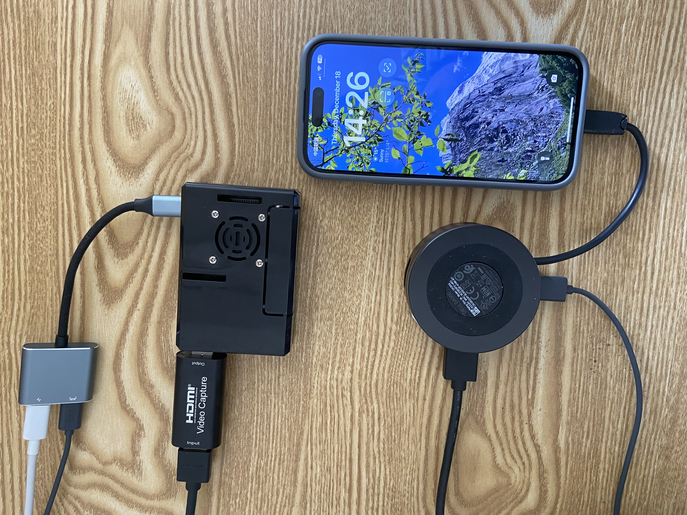
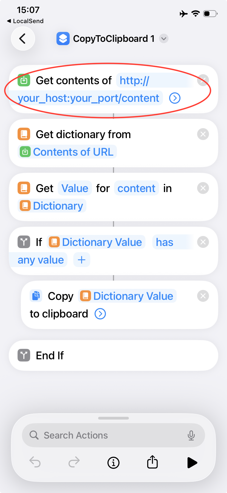
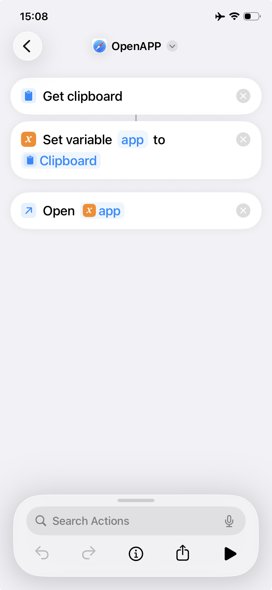

# 📱 Open iPhone Agent — An Open iPhone Agent Model & Control Framework

> This project is a secondary development based on the open-source projects **[Open-AutoGLM](https://github.com/zai-org/Open-AutoGLM)** and **[PiKVM](https://github.com/pikvm/pikvm)**. We pay tribute to the original projects.

> Model and inference configurations reference and are based on Zhipu AI (Z.ai)’s open-source Open-AutoGLM. The goal is to extend open-source multimodal large-model capabilities into iPhone operation scenarios and build an extensible, hardware-replaceable **iPhone Agent framework** to unlock “AI-driven iPhone automation” use cases.

---

## Current Status (Important)

* The project is in the **PoC (proof of concept) stage**.
* A **PiKVM-alternative solution** has been found; the hardware dependency on PiKVM can optionally be removed in the future.
* Experimentally validated on **iPhone 15 / 16 / 17**.
* Target users: developers, researchers, and engineering teams exploring iPhone automation.

> ⚠️ This project is for research and learning purposes only. It must not be used for illegal information access, system interference, or any unlawful activity. Please carefully review the Terms of Use (`resources/privacy_policy_en.txt`).

---

## Core Capabilities (What it does)

* Uses open-source **multimodal large models** (vision + text) to understand the screen and plan operations.
* Chains **visual understanding → task planning → action generation** into executable instructions.
* Implements text input, app launching/navigation, and other actions via **iOS Shortcuts**.
* Supports natural-language commands (Chinese / English bilingual) and can run via third-party or locally deployed models (flexible).

---

## Architecture Overview

```
User instruction (text / voice)
   ↓
AutoGLM-Phone (local or cloud inference)
   ↓
iPhone Agent (task planning & action generation)
   ↓
PiKVM / alternative (video capture + keyboard/mouse or OTG input)
   ↓
iPhone (Shortcuts receive & execute)
```

---

## Verified Environments

* iOS: **iOS 17.2.1 and later** (tested devices: iPhone 15 / 16 / 17)
* Recommended model: **AutoGLM-Phone-9B** (including multilingual variant)
* Supports Chinese, English, and other multilingual scenarios

---

## Hardware (example configuration — replaceable)

> The example below uses **Raspberry Pi 4B + PiKVM**. This dependency can be optionally removed with alternative solutions.

**Hardware list**

* Raspberry Pi 4B (or other device capable of running PiKVM)
* OTG expansion module (for injecting USB keyboard/mouse)
* HDMI capture card (for video capture)
* HDMI cable
* Type-C hub (must include USB and HDMI outputs)

**Connection diagram**

1. Connect the iPhone to the Type-C hub.
2. Hub HDMI → HDMI capture card; hub USB → OTG expansion module.
3. HDMI capture card connects to the Raspberry Pi (PiKVM).
4. The OTG module is used to inject keyboard/mouse input into the iPhone (or injected by the alternative solution).
<p>
  
</p>
---

## Software & Models (Downloads)

| Model                         | Download Links                                                                                                                                                         |
| ----------------------------- | ---------------------------------------------------------------------------------------------------------------------------------------------------------------------- |
| AutoGLM-Phone-9B              | [🤗 Hugging Face](https://huggingface.co/zai-org/AutoGLM-Phone-9B)<br>[🤖 ModelScope](https://modelscope.cn/models/ZhipuAI/AutoGLM-Phone-9B)                           |
| AutoGLM-Phone-9B-Multilingual | [🤗 Hugging Face](https://huggingface.co/zai-org/AutoGLM-Phone-9B-Multilingual)<br>[🤖 ModelScope](https://modelscope.cn/models/ZhipuAI/AutoGLM-Phone-9B-Multilingual) |

> **Thanks to Zhipu AI ([Z.ai](https://z.ai/)) for open-sourcing Open-AutoGLM.**

---

## Environment Preparation

### System & Language

* Recommended Python **3.10+**

### iPhone Side (Shortcuts)

* Install the required Shortcuts on the iPhone, such as [OpenAPP](https://www.icloud.com/shortcuts/c2560bb5426449eda720b409f89627a7) and [CopyToClipboard](https://www.icloud.com/shortcuts/f61c7bdd585a46de903852173620706e) (or custom equivalent shortcuts).
* Configure the `CopyToClipboard` shortcut to point to the FastAPI server IP:PORT on your machine/server (used to receive content/commands sent by the Agent).
<div style="display:flex; gap:10px;">
  
  
</div>

---

## Quick Deployment Guide

### Install project dependencies

```bash
pip install -r requirements.txt
pip install -e .
```

### Start the FastAPI service (open a new terminal in the project root)

```bash
uvicorn iphone_agent.fastapi_main:app --reload --host 0.0.0.0 --port 6666
```

---

## First-Time Setup (iPhone Accessibility & Shortcut Key Configuration)

> To allow the Agent to simulate keyboard interactions, enable accessibility options on the iPhone and assign keyboard shortcuts to Shortcuts (a physical or Bluetooth keyboard may be required).

**Steps (in order)**

1. Settings → Accessibility → Touch → **AssistiveTouch**: turn on.

2. Settings → Accessibility → Keyboards & Input → **Full Keyboard Access**: turn on.

3. Prepare a physical or Bluetooth keyboard (for the initial configuration).

4. In **Full Keyboard Access → Commands**, bind keyboard shortcuts to frequently used actions / Shortcuts, for example:

   * Home screen (mapped to some command) → bind `Alt + h`
   * Shortcut `OpenAPP` → bind `Alt + o`
   * Shortcut `CopyToClipboard` → bind `Alt + c`

5. Save and test: press the assigned key combinations on the keyboard and confirm the iPhone triggers the corresponding Shortcuts/actions.

> Tip: The example key bindings above are illustrative. UI layout may vary across iOS versions and devices—bind and test according to your local interface.

---

## Model Service Deployment (two options)

You can choose to **use third-party model services (recommended)** or **deploy models yourself (local inference)**.

---

### A. Use third-party model services (recommended)

**1. Zhipu BigModel**

* See BigModel official docs for documentation and integration.
* Example parameters:

```text
--base-url: https://open.bigmodel.cn/api/paas/v4
--model: autoglm-phone
--apikey: <your-bigmodel-api-key>
```

**2. ModelScope**

* Example parameters:

```text
--base-url: https://api-inference.modelscope.cn/v1
--model: ZhipuAI/AutoGLM-Phone-9B
--apikey: <your-modelscope-api-key>
```

**Call example**

```bash
python main.py \
  --base-url https://open.bigmodel.cn/api/paas/v4 \
  --model "autoglm-phone" \
  --apikey "your-bigmodel-api-key" \
  "打开美团搜索附近的火锅店"
```

---

### B. Self-hosted deployment (local / private cloud)

**Recommended inference engines**

* **vLLM** (recommended)
* **SGLang**

> See the “For Model Deployment” section in `requirements.txt` for dependencies.

**vLLM startup example (recommended args)**

```bash
python3 -m vllm.entrypoints.openai.api_server \
  --served-model-name autoglm-phone-9b \
  --allowed-local-media-path / \
  --mm-encoder-tp-mode data \
  --mm_processor_cache_type shm \
  --mm_processor_kwargs '{"max_pixels":5000000}' \
  --max-model-len 25480 \
  --chat-template-content-format string \
  --limit-mm-per-prompt '{"image":10}' \
  --model zai-org/AutoGLM-Phone-9B \
  --port 8000
```

**SGLang startup example**

```bash
python3 -m sglang.launch_server \
  --model-path zai-org/AutoGLM-Phone-9B \
  --served-model-name autoglm-phone-9b \
  --context-length 25480 \
  --mm-enable-dp-encoder \
  --mm-process-config '{"image":{"max_pixels":5000000}}' \
  --port 8000
```

> Note: AutoGLM-Phone shares architecture with GLM-4.1V-9B-Thinking. For deeper optimization, refer to GLM-V series docs (model architecture, quantization, parallel strategies, etc.).

---

## Model Service Verification

Use the included script to check deployment:

```bash
python scripts/check_deployment_cn.py \
  --base-url http://<your-ip>:<port>/v1 \
  --model <model-name>
```

**Expected log snippet (example)**

```text
<think>
User wants to compare the price of this shampoo on JD and Taobao...
</think>
<answer>
do(action="Launch", app="JD")
</answer>
```

> If the returned “chain-of-thought” is abnormally short or garbled, this usually indicates deployment or dependency issues. Troubleshoot by checking: dependency versions, model path, inference engine startup parameters, and memory/GPU resource limits.

---

## How to Use (examples)

### Command-line interactive

```bash
# Start an interactive session, connecting to a local vLLM service
python main.py \
  --base-url http://localhost:8000/v1 \
  --model "autoglm-phone-9b"
```

```bash
# Ask the Agent to perform a task directly
python main.py \
  --base-url http://localhost:8000/v1 \
  "打开美团搜索附近的火锅店"
```

### English prompt example

```bash
python main.py \
  --lang en \
  --base-url http://localhost:8000/v1 \
  "Open Chrome browser"
```

### List supported apps

```bash
python main.py --list-apps
```

### Python API quick example

```python
from phone_agent import PhoneAgent
from phone_agent.model import ModelConfig

model_config = ModelConfig(
    base_url="http://localhost:8000/v1",
    model_name="autoglm-phone-9b",
)

agent = PhoneAgent(model_config=model_config)
result = agent.run("打开淘宝搜索无线耳机")
print(result)
```

---

## Troubleshooting & Suggestions

* **Model output is very short or garbled**: check inference service logs, model path, dependency versions, and available GPU/VRAM.
* **iPhone does not respond to shortcuts / keys**: ensure “Full Keyboard Access” is enabled and shortcuts are correctly bound; try triggering the bindings manually via a physical keyboard.
* **Video / keyboard & mouse not injected**: verify HDMI capture and OTG module connections; check PiKVM (or alternative) service status and permissions.
* **Performance bottlenecks**: for local deployment, first check VRAM, parallel configuration, and model quantization/sharding strategies (see vLLM / SGLang docs).

---

## Roadmap

1. Remove strong dependency on Raspberry Pi / PiKVM and provide purely software or more general hardware alternatives (in testing).
2. Add support for more apps (PRs or app URL schemes are welcome).
3. Optimize model and inference efficiency (quantization, caching, parallelization, etc.).
4. Expand examples and add automated test suites.

---

## Contributing & Contact

Contributions are welcome — please open issues or PRs, or contact us via the methods listed in the README. If you implement new Shortcuts, alternative input schemes, or compatible devices, please contribute examples and test results.
